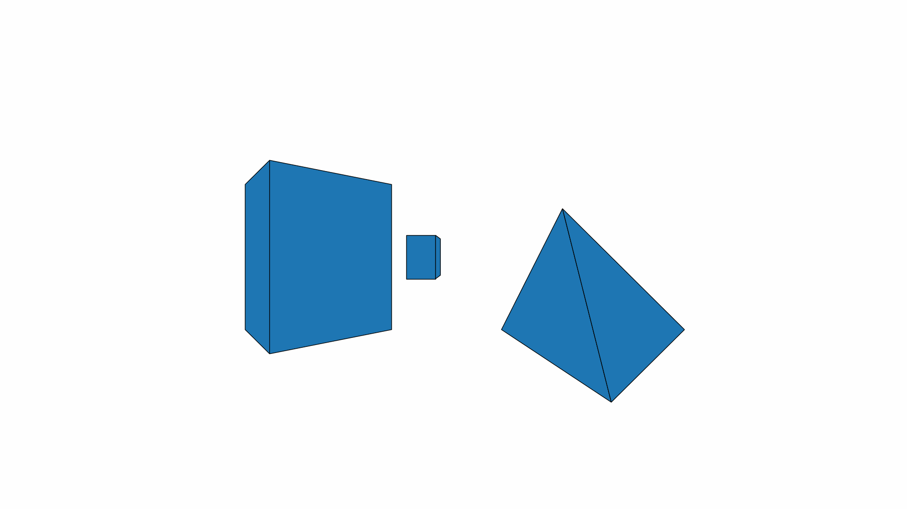

# Readme

This repo is the Python implementation of Coursera course Robotics: Perception.

## Summary

<table>
  <tr>
    <th>Calibration</th>
    <th>Dolly Zoom</th>
    <th>Image Projection</th>
  </tr>
  <tr>
    <td></td>
    <td></td>
    <td></td>
  </tr>
</table>